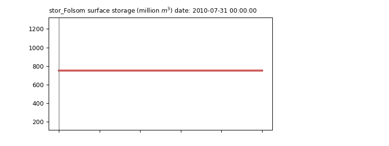
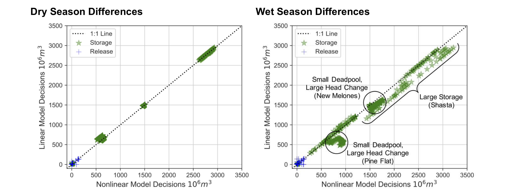
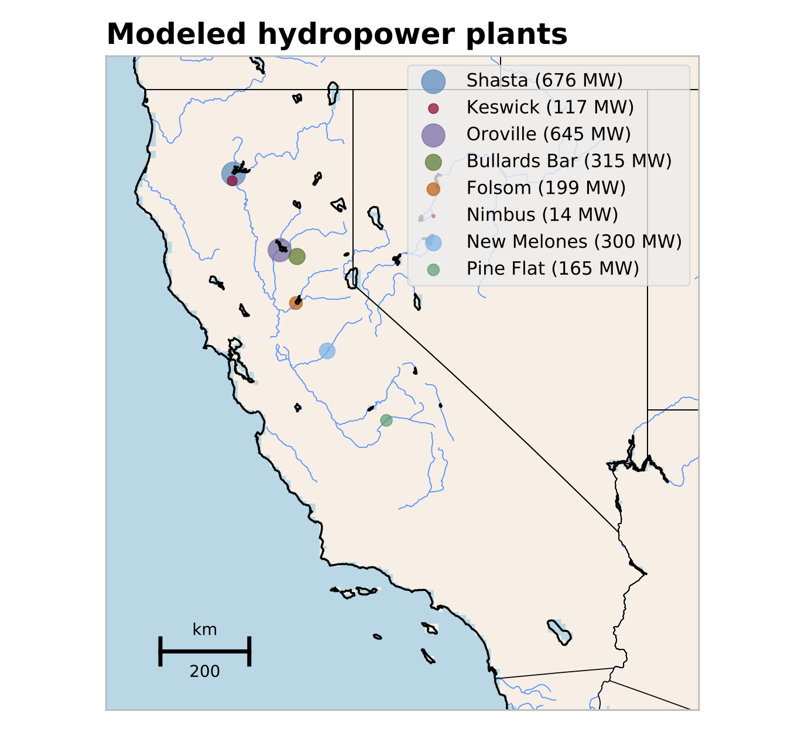
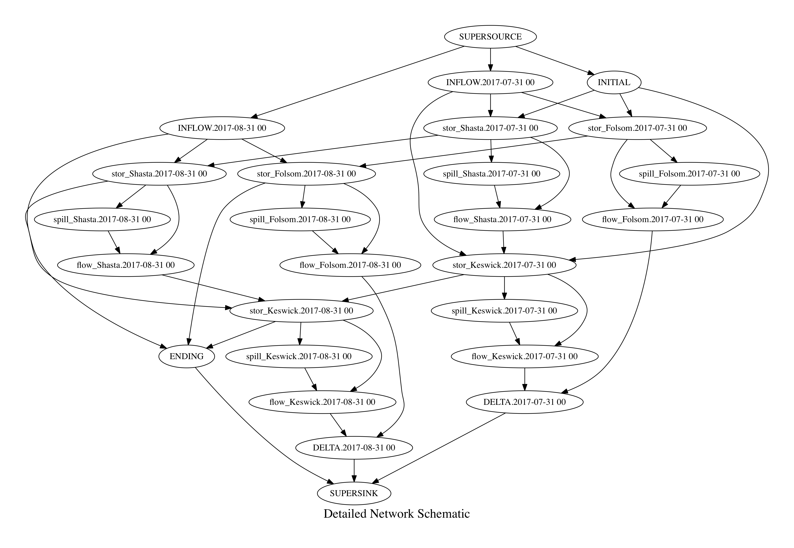

# Hybrid LP-NLP Hydropower optimization model in pyomo

This is an object-oriented, hybrid linear-nonlinear programming hydropower optimization model for California. It is modeled in pyomo, high level optimization programming language. The model is capable of creating linear and nonlinear hydropower models. Since linear model is much faster than nonlinear, its results can be used as a initial solution (warmstart) for the nonlinear model. Linear model results can also be used as stand alone. When `warmstart=True` and both LP and NLP models run sequentially, initial primal variables from LP model are fed into NLP model, decreasing iterations for convergence and runtime.

### Documentation
Dogan, M.S.; Lund, J.R.; Medellin-Azuara, J., 2021. [Hybrid Linear and Nonlinear Programming Model for Hydropower Reservoir Optimization](https://ascelibrary.org/doi/abs/10.1061/%28ASCE%29WR.1943-5452.0001353). *Journal of Water Resources Planning and Management*. 147(3). [https://www.doi.org/10.1061/%28ASCE%29WR.1943-5452.0001353](https://www.doi.org/10.1061/%28ASCE%29WR.1943-5452.0001353).

Dogan, M.S., 2019. [Hydropower Generation Optimization in the Era of Renewables and Climate Change](https://watershed.ucdavis.edu/shed/lund/students/Mustafa_Dogan_dissertation2019.pdf). Doctoral Dissertation. University of California, Davis

[](https://zenodo.org/badge/latestdoi/194236128)

## Nonlinear model

The model represents nonlinearities of hydropower due to storage (so water head). Head is dynamically calculated as a polynomial function of storage. Polynomial functions are predetermined and plant-specific. Large-scale nonlinear solver `ipopt` is used to solve the problem.

`ipopt` documentation and solver options can be found at:

https://www.coin-or.org/Ipopt/documentation/documentation.html

## Linear model

Unlike nonlinear model, head is not dynamically calculated. Unit benefits are predetermined based on maximum benefit from maximum storage and release. Large-scale nonlinear solvers `glpk` or `cbc` can be used to solve the problem. For linear model, unit price (slope) values `c` must be defined for storage and release. So, during LP preprocessing (network export process), for each time step, using `scipy`, a linear benefit surface (below) is fit to a nonlinear benefit curve (below), minimizing error due to fit. And then, unit price or slope values are obtained for the LP model.

```python
from scipy import optimize # used to fit linear curve
def fun(x): # maximize r2
    benefit_linear = stx*x[0]+fly*x[1]
    SSE = np.sum((benefit_nonlinear-benefit_linear)**2)
    SST = np.sum((benefit_nonlinear-np.mean(benefit_nonlinear))**2)
    r2 = 1-SSE/SST
    return -r2
x0 = np.array([1,1])
res = optimize.fmin(fun,x0,disp=False)
```
## Residuals

Error or residuals between nonlinear and linear benefits curve vary depending on storage and release. However, there is a region where residuals are zero; between (mid storage, max release) and (max storage, mid release).

## Benefit curves for nonlinear and linear models and residuals

 

## Typical outputs:
+ `flow_cms.csv` releases and flows (cubic meter per second) on links
+ `storage_million_m3.csv` reservoir storages (million cubic meter)
+ `dual_lower_flow.csv` dual values on lower bound constraints for flow links
+ `dual_lower_storage.csv` dual values on lower bound constraints for storage links
+ `dual_upper_flow.csv` dual values on upper bound constraints for flow links
+ `dual_upper_storage.csv` dual values on upper bound constraints for storage links
+ `dual_node.csv` dual values on mass balance constraints
+ `power.csv` power (megawatt)
+ `generation_MWh.csv` power generation (megawatt hour)
+ `revenue_$.csv` power revenue (dollar)

### Visualization

 

## WARM-STARTED solve

```python
warmstart = True
```
Warmstart option improves runtime and feasiblity for Nonlinear Programming model by obtaining optimized decision variables from a previous feasible solution. If warm start option is enabled, the model is solved twice: first with initial (warmstart) values of variables and then updated suffix parameters from initial solve. Initial variable values (flow and storage) are obtained from `unorganized_f.csv` and `unorganized_s.csv`. So, the model must have solved in defined time-step (frequency) first. Otherwise, initial values will be zero even if `warmstart = True`. The idea is that first Linear Programming model is solved, then output decision variables are fed into Nonlinear Programming model to boost runtime and feasibility. The code can be modified to read initial decision variable values from a previous NLP model outputs (`warmstart_path`). Warmstart is not modeled with LP model since it is already fast enough.

## Time-step selection

The model is flexible on time-step selection and supports several time-step options, ranging from hourly to annual. As long as input data has high resolution (or at least higher than desired time-step), during preprocessing data files are generated based od selected time-step. Currently price and flow data have hourly time-step, so the model can create hourly, daily, weekly, monthly or annual averages. Also, if `overall_average=True`, time-series are grouped based on selection. For example, `overall_average=True` and `step=['H']`, then the model will create average of all hours from 0 to 23. Finally, multiple time indices are supported. If `overall_average=True` and `step=['A','H']`, the model will create time-step for each year and hour between start and end time.

## Errors between NLP and LP

Benefit curves drive operations for both NLP and LP models. While benefit curve and its function optimized and water head is dynamically calculated for NLP model, prescribed linear benefit curves are used for LP model. Differences between benefit curves (residuals) are discussed above. Due to residuals, errors on output decision variables occur.

 

## Network schematic



## Detailed network schematic (multi-stage)



## Dependencies

Required:
+ [`python`](https://www.anaconda.com/download/#macos) programming language (Anaconda recommended)
+ [`pyomo`](https://anaconda.org/conda-forge/pyomo) library and [`pyomo extras`](https://anaconda.org/conda-forge/pyomo.extras)
+ [`ipopt`](https://anaconda.org/conda-forge/ipopt) nonlinear programming solver
+ [`glpk`](https://anaconda.org/conda-forge/glpk) or [`CBC`](https://anaconda.org/conda-forge/coincbc) linear programming solver

After installing Anaconda, pyomo and solvers can be installed by running the command:
```bash
conda install -c conda-forge pyomo pyomo.extras glpk ipopt
```

Optional:
+ [`Basemap`](https://anaconda.org/conda-forge/basemap) for displaying plants on a map
+ [`graphviz`](https://anaconda.org/conda-forge/graphviz) printing network schematic

## Solver Runtime

Linear programming (LP) model runs significantly faster than nonlinear programming (NLP) model. Runtime (wall clock time) scalability for different number of decision variables are shown below on a semi-log scale. Runtime increases exponentially as number of decision variables increase. Although NLP and NLP warmstart models have similar orders of magnitude, O(n^3), overall warmstart option reduces runtime in all model sizes.


## This repository is greatly benefited from calvin

https://github.com/ucd-cws/calvin
